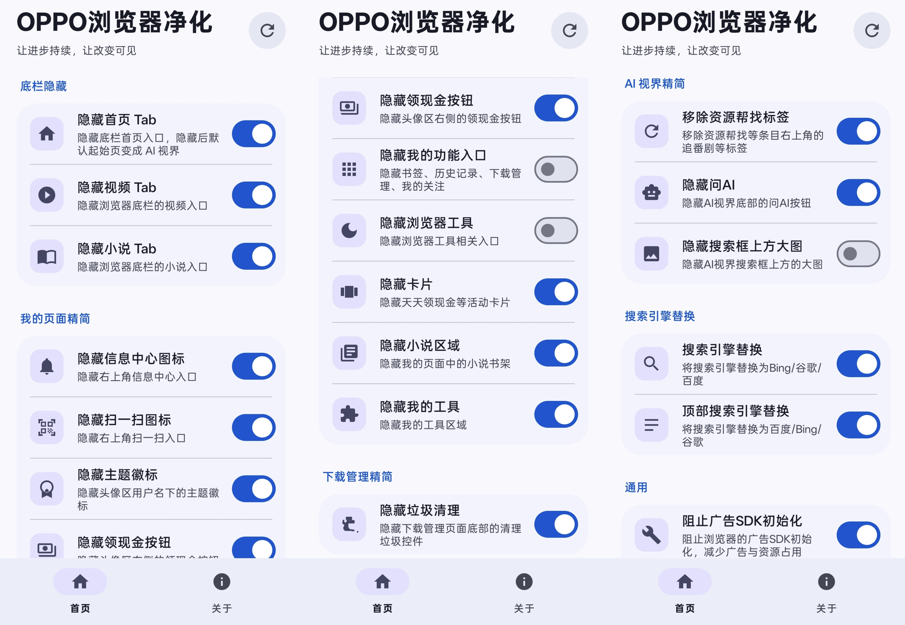

# OPPO 浏览器净化

基于 Xposed 的 OPPO 浏览器净化模块，用于隐藏不需要的页面入口、活动内容和广告相关组件，减少浏览器界面干扰。



## 当前版本

- 适配浏览器：`浏览器_40.10.19.17（10191700）`
- 目标包名：`com.heytap.browser`
- 最低 Android 版本：Android 10（API 29）
- 编译目标：Android 14（API 34）
- Xposed 接口：legacy API 82

本项目针对上述浏览器版本开发和测试。浏览器升级后，混淆类名、资源 ID 或内部逻辑可能发生变化，功能不保证继续有效。

## 功能

### 底栏隐藏

- 隐藏小说 Tab
- 隐藏视频 Tab
- 隐藏首页 Tab
- 隐藏首页后，将默认起始页切换到 AI 视界
- 拦截首页作为默认起始页的设置

### 我的页面精简

- 隐藏信息中心图标
- 隐藏扫一扫图标
- 隐藏主题徽标
- 隐藏领现金按钮
- 隐藏我的功能入口
- 隐藏浏览器工具区域
- 隐藏活动卡片
- 隐藏小说区域
- 隐藏我的工具区域

### 下载管理精简

- 隐藏下载管理页面底部的垃圾清理控件

### AI 视界精简

- 移除“资源帮找”等条目的右上角标签
- 隐藏底部“问 AI”按钮
- 隐藏搜索框上方大图

### 搜索引擎替换

- 设置页搜索引擎仅保留 Bing、Google、百度
- 将搜索结果页顶部频道替换为百度、Bing、Google

### 通用功能

- 阻止穿山甲广告 SDK 初始化
- 隐藏模块桌面图标，同时保留从 LSPosed 进入模块设置的能力


## 安装与使用

1. 安装模块 APK。
2. 在 LSPosed 中启用“OPPO 浏览器净化”。
3. 将作用域设置为 OPPO 浏览器：`com.heytap.browser`。
4. 打开模块设置页，按需启用功能。
5. 强行停止并重新打开 OPPO 浏览器。

## 构建

需要 Android Studio 或可用的 Android 构建环境，并安装 Android SDK Platform 34、Build Tools 和 Java 17，使用与 Android Gradle Plugin `8.2.2` 兼容的 Gradle 版本。

```bash
gradle :app:assembleDebug
```


## 项目结构

- `app/src/main/java/`：模块源码
- `app/src/main/res/`：界面资源和图标
- `app/src/main/assets/xposed_init`：legacy Xposed 入口声明
- `app/libs/api-82.jar`：编译期使用的 Xposed API 82 依赖

## 第三方依赖

- [Xposed API](https://github.com/rovo89/XposedBridge)：提供 Xposed 模块接口，本项目使用 legacy API 82 编译期引用
- [Material Components for Android](https://github.com/material-components/material-components-android)：用于设置界面
- [AndroidX Core](https://developer.android.com/jetpack/androidx)：提供 AndroidX 基础兼容能力
- [Android SDK](https://developer.android.com/studio)：用于 Android 编译和 APK 构建
- [Gradle](https://gradle.org/) 与 Android Gradle Plugin：用于项目构建

第三方项目的许可证和版权归原作者所有。

## 免责声明

本项目仅用于个人学习、研究和界面定制。使用 Xposed Hook 可能导致 OPPO 浏览器功能异常、崩溃或数据丢失，请在使用前做好备份。因使用本项目造成的任何问题由使用者自行承担。

## 许可证

本项目采用 [MIT License](LICENSE)。
